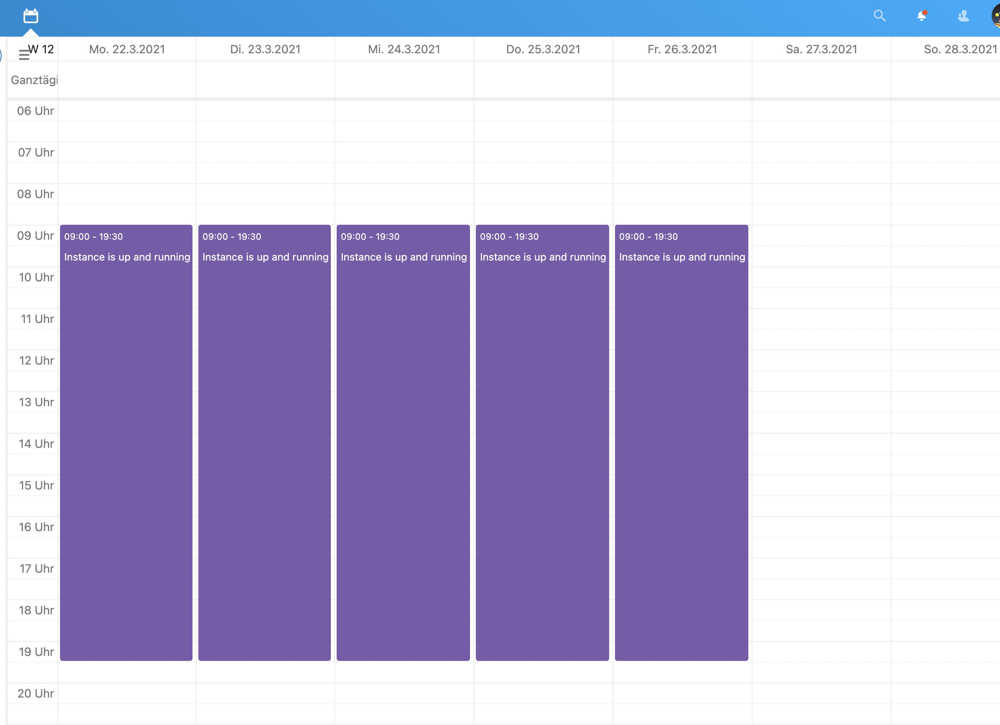

# hcloud calendar automation 

hetzner cloud automation with the help of a public accessible (web/i)calendar

These scripts create a snapshot from a running server when a calendar entry expires, destroy that server, and later recreate the server when a new calendar entry is available.

## Cost and Risks
Be aware, that any running server and every snapshot you create will cost you money. Maybe it is obvious, but just in case you don't know.

The author of these scripts does not take any responsibility for any functionality or any of your resulting costs. 

Use this as-is and at your own responsibility and risk.

## Usage
### Prepare your calendar events
You have to configure one public accessible webdav or ical-calendar per running server instance in your hetzner cloud project.

One event in your calendar means: this server should run from event-start til event-end-time:

The server is up and running every weekday from 9 am til 7 pm

Overlapping events are handled like one big event:


Server is up and running on 24.03.2021 form 9am til 10pm.

You can configure the behaviour with the following variables in your `config.py`:
 * **TIMESLICE_GRID_INTERVAL** (default: 15 minutes)
   this is the grid-size, your calendar events are mapped to.
   
This means, if your interval is 15 minutes and your event-duration is 5 minutes, the server is at least 15 minutes up.

every event-start and end-date is round down/up to this interval (after substracting START_ADVANCED_TIME/adding END_LAG_TIME)

 * **START_ADVANCED_TIME**  (default: 10 minutes)
   if this is not 0, each event is internally mapped to an earlier "starting-time" than your calender event. 
   
E.g. if your users expect the server "should be on on event-start", this time should the timespan you need to create your server-instance.

 * **END_LAG_TIME** (default: 30 minutes)
   if this is not 0, each event is internally mapped to last this time longer, than your calender event. 
   
This is useful, if you have something like a video-server and your users are know to chitchat longer than they might think.

### Example

Our `config.py` looks as follows:
```
TIMESLICE_GRID_INTERVAL = 15
START_ADVANCED_TIME = 10
END_LAG_TIME = 30
```

This is our calender (the red-boxes are for explanation)


The above calender and the given `config.py` results in the following server uptimes:
 1) 08:45:00 - 10:44:59 -> server is created at 8:45 and destroyed at 10:45
 2) 10:45:00 - 14:59:59 -> server is created at 10:45 and destroyed at 15:00
 3) 15:45:00 - 18:14:59 -> server is created at 15:45 and destroyed at 18:15

**Be Aware!** 
Up to now, these scripts do not use any technical or application-specific monitoring. If time is over, server gets destroyed.
The server is destroyed in the following condition:
all calender-events + end_lag_time ar over and the next timeslice-grid-interval is reached.


## Installation
### Prepare your Hetzner-Cloud-Project
Log into your Hetzner-Cloud-Project. Before you can use this scripts, you need a running and configured server.
Installation and configuration of your cloud server is out of scope of these scripts.

To let the magic of creation and mapping happen, you have to minimum "tag" your resources with a unique label.
The label-name is `token`. 

Add the label to the running server, your floating-ip (if you use this resource) and your ssh-key.

A good resource for creating a unique-token is [random.org](https://www.random.org/strings/?num=1&len=10&digits=on&upperalpha=on&loweralpha=on&unique=on&format=html&rnd=new)

Add the unique token in your `config.py` as **IMAGE_TOKEN** or use `install.py`

You also need an API Key with read-write-access for your cloud project.

Add this API Key in your `config.py` as **API_TOKEN** or use `install.py`

### Prerequisites
Before you start installing, make sure to have following things in place:
 * your hetzner cloud api-key with read and write access
 * your public accessable webcal-url (eg. from nextcloud or something else)
 * some random token, mapped as labe/tag in your server-resources

### Installation
1) clone this repository
    ```
    git clone git@github.com:uroflavin/hcloud-calendar-automation.git
    ```
   
2) change into the directory
    ```
    cd hcloud_calendar_automation/
    ```

3) install virual environemt, requirements and systemd-service 
    ```
    python3.9 install.py
    ```

4) check config.py and systemd status